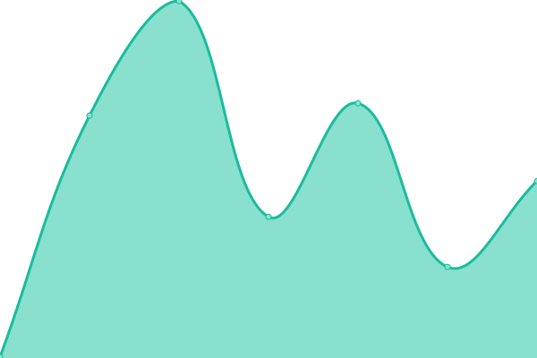
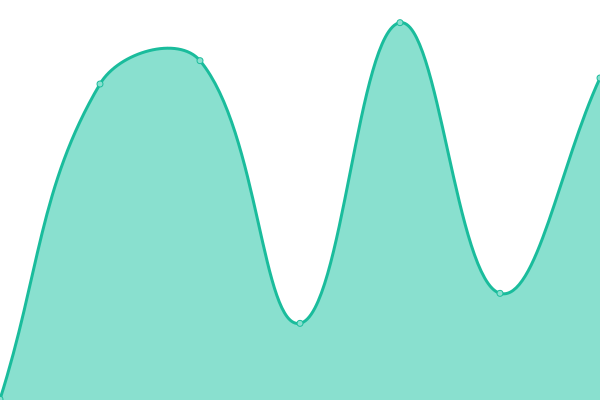

# [📈 Live Status](https://fearedfusionx.github.io/statusesofpagesIuse): <!--live status--> **🟩 All systems operational**

## Congrats!

### You stumbled on an absolutely random Respository. Now get out.

This repository contains the open-source uptime monitor and status page for [Sinjin](https://fearedfusionx.github.io/statusesofpagesIuse), powered by [Upptime](https://github.com/upptime/upptime).

With [Upptime](https://upptime.js.org), you can get your own unlimited and free uptime monitor and status page, powered entirely by a GitHub repository. We use [Issues](https://github.com/FearedFusionX/statusesofpagesIuse/issues) as incident reports, [Actions](https://github.com/FearedFusionX/statusesofpagesIuse/actions) as uptime monitors, and [Pages](https://demo.upptime.js.org) for the status page.

<!--start: status pages-->
<!-- This summary is generated by Upptime (https://github.com/upptime/upptime) -->
<!-- Do not edit this manually, your changes will be overwritten -->
<!-- prettier-ignore -->
| URL | Status | History | Response Time | Uptime |
| --- | ------ | ------- | ------------- | ------ |
|  [Schoology LAUSD](https://lms.lausd.net) | 🟩 Up | [schoology-lausd.yml](https://github.com/FearedFusionX/statusesofpagesIuse/commits/HEAD/history/schoology-lausd.yml) | 

 387ms
     
 | 

<a href="https://FearedFusionX.github.io/statusesofpagesIuse/history/schoology-lausd">100.00%</a>
    

|  [Desmos](https://www.desmos.com/calculator) | 🟩 Up | [desmos.yml](https://github.com/FearedFusionX/statusesofpagesIuse/commits/HEAD/history/desmos.yml) | 

 281ms
     
 | 

<a href="https://FearedFusionX.github.io/statusesofpagesIuse/history/desmos">100.00%</a>
    

|  [Deltamath](https://www.deltamath.com/app/student) | 🟩 Up | [deltamath.yml](https://github.com/FearedFusionX/statusesofpagesIuse/commits/HEAD/history/deltamath.yml) | 

 111ms
     
 | 

<a href="https://FearedFusionX.github.io/statusesofpagesIuse/history/deltamath">100.00%</a>
    

|  [Skieslearn](https://skieslearn.com/ui/course/filter/student) | 🟩 Up | [skieslearn.yml](https://github.com/FearedFusionX/statusesofpagesIuse/commits/HEAD/history/skieslearn.yml) | 

 311ms
     
 | 

<a href="https://FearedFusionX.github.io/statusesofpagesIuse/history/skieslearn">100.00%</a>
    

<!--end: status pages-->

[**Visit our status website →**](https://fearedfusionx.github.io/statusesofpagesIuse)

## 📄 License

- Powered by: [Upptime](https://github.com/upptime/upptime)
- Code: [MIT](./LICENSE) © [Sinjin](https://demo.upptime.js.org)
- Data in the `./history` directory: [Open Database License](https://opendatacommons.org/licenses/odbl/1-0/)
